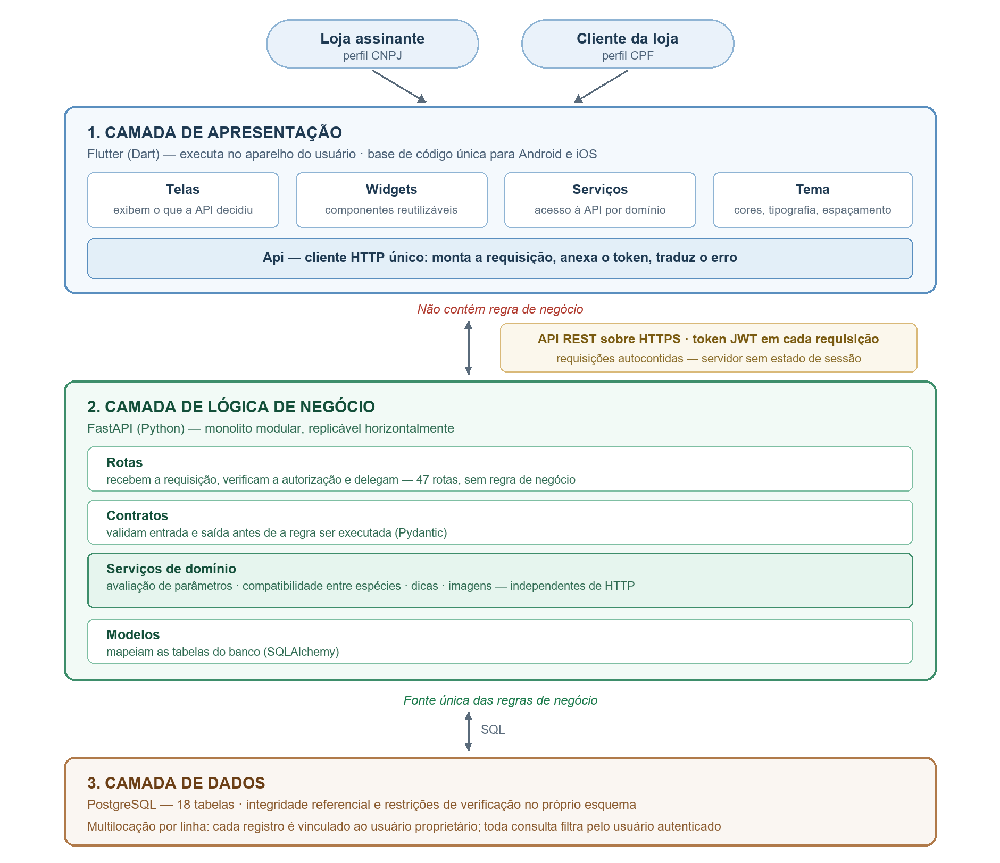

# AquaSys: aplicativo móvel para gestão de aquários e apoio à manutenção profissional em modelo SaaS

Weslley Cesar Zampier¹, Brenda Lopes Levandoski¹

¹Centro Universitário Campo Real
Rua Comendador Norberto, 1299 — Santa Cruz — Guarapuava — PR — Brasil

{engs-weslleyzampier@camporeal.edu.br, prof_brendalevandoski@camporeal.edu.br}

---

## Resumo

## Abstract

## 1. Introdução

O aquarismo ornamental é uma das atividades de lazer mais difundidas no mundo. Biondo e Burki (2021) apontam que seu comércio global movimenta bilhões de dólares por ano e abrange milhares de espécies. No Brasil, a aquicultura ornamental cresce sustentada pela diversidade da fauna nativa e pela demanda por espécies tropicais (MENDONÇA; THOMÉ, 2020).

O crescimento convive com desistência expressiva. Manter um aquário equilibrado é manter um ecossistema artificial cujo funcionamento depende de variáveis químicas invisíveis a olho nu. Lins (2021) demonstra que a qualidade da água é o fator mais crítico para a sobrevivência de organismos em cativeiro, e que desvios discretos em pH, temperatura, amônia, nitrito e nitrato bastam para causar estresse, doença e morte. O iniciante costuma descobrir essa complexidade só depois das primeiras perdas.

Duas dificuldades concretas emergem daí. A primeira é que o controle da água não depende só de medir, mas de saber o que o número significa para *aqueles* peixes: a faixa ideal de pH não é constante do aquário, e sim consequência de quem vive nele — pH 8,0 é saudável em um marinho e alarme em um comunitário de tetras amazônicos. A segunda é que a compatibilidade entre espécies exige cruzar porte, comportamento, faixa de parâmetros e hábito alimentar, dados que raramente estão reunidos em um só lugar.

Há ainda um público invisível na literatura consultada: o profissional que presta manutenção a domicílio. Em levantamento junto a uma loja de aquarismo de Guarapuava, verificou-se que as visitas são registradas em fichas de papel, arquivadas sem possibilidade de consulta; o técnico redigita os dados do mesmo cliente a cada visita e não consegue comparar o estado atual de um aquário com o da manutenção anterior.

As iniciativas existentes atacam apenas parte do problema: a automação por sensores é eficaz na coleta do dado, mas não orienta sobre o significado da medição nem trata da convivência entre espécies, e os aplicativos disponíveis são majoritariamente estrangeiros e sem previsão de uso profissional, conforme detalhado na Seção 3.

Diante dessa lacuna, este trabalho propõe o AquaSys, aplicativo móvel distribuído no modelo *Software as a Service* (SaaS) que atende, a partir de uma base de código única, o aquarista e o profissional que o assiste. O sistema oferece acompanhamento de múltiplos aquários, avaliação automática dos parâmetros com alertas explicados em linguagem corrente, catálogo de espécies com motor de compatibilidade, ficha digital de manutenção e trilhas de conteúdo educacional.

O objetivo geral é **projetar, desenvolver e avaliar um protótipo funcional do AquaSys**, verificando sua viabilidade técnica e sua usabilidade. Como objetivos específicos: levantar os requisitos junto aos dois públicos; analisar os estilos arquiteturais aplicáveis e justificar a arquitetura adotada frente às alternativas; implementar o protótipo; verificar sua corretude por testes automatizados; e validar a usabilidade por Avaliação Heurística.

O texto está organizado como segue. A Seção 2 apresenta o referencial teórico, com ênfase em arquitetura de software. A Seção 3 expõe o Estado da Arte. As Seções 4 e 5 descrevem as metodologias de pesquisa e de desenvolvimento. A Seção 6 apresenta os resultados obtidos.

## 2. Referencial Teórico

Esta seção apresenta os conceitos fundamentais que embasam a proposta do AquaSys, abrangendo aquarismo e qualidade da água, arquitetura de software e a distribuição de responsabilidades entre cliente e servidor, o modelo *Software as a Service* (SaaS) e a multilocação, as tecnologias adotadas no desenvolvimento e a experiência do usuário em aplicações de monitoramento.

### 2.1. Aquarismo e qualidade da água

O aquarismo é a prática de criação e manutenção de organismos aquáticos em ambientes controlados, combinando biologia, química e projeto de ambientes (MAZZIERO *et al.*, 2023). Manter um aquário saudável é manter estável um ciclo biológico: os resíduos dos peixes liberam amônia (NH₃), altamente tóxica; bactérias nitrificantes que colonizam o filtro a convertem em nitrito (NO₂⁻), também tóxico, e depois em nitrato (NO₃⁻), tolerável em concentrações moderadas e removido pelas trocas parciais de água. Esse é o ciclo do nitrogênio, e sua maturação leva semanas — um aquário povoado antes disso acumula amônia e mata seus habitantes, causa frequente das perdas relatadas por iniciantes (LINS, 2021).

O AquaSys monitora o **pH**, que mede se a água é ácida ou alcalina em escala de 0 a 14 — até 6,8 ácida, 7,0 neutra, de 7,2 a 14 alcalina, sendo que cada espécie evoluiu em uma faixa específica; a **temperatura**, cujas variações bruscas são mais nocivas que um valor estável ligeiramente fora do ideal; a **amônia** e o **nitrito**, tóxicos em qualquer concentração mensurável; o **nitrato**, controlado pelas trocas de água; e a **dureza**, que afeta a osmorregulação (LINS, 2021).

Além da química, o povoamento determina o sucesso do aquário: a convivência depende do porte adulto — um peixe grande predará qualquer outro que caiba em sua boca —, do comportamento territorial, do nível de natação ocupado e da sobreposição entre as faixas de parâmetros toleradas, e espécies de cardume mantidas abaixo do mínimo desenvolvem estresse crônico. Esses cruzamentos são a segunda barreira de conhecimento do iniciante e o objeto do motor descrito na Seção 5.6. A limitação das soluções de automação, apontada por Mazziero *et al.* (2023), é que a leitura automatizada resolve a medição, não a interpretação.

### 2.2. Arquitetura de software

A arquitetura de software é o conjunto de estruturas necessárias para raciocinar sobre o sistema, compreendendo seus elementos, as relações entre eles e as propriedades de ambos (BASS; CLEMENTS; KAZMAN, 2021). Sommerville (2018) acrescenta que o projeto arquitetural estabelece o vínculo entre a especificação de requisitos e o processo de projeto, e que as decisões tomadas nesse momento determinam atributos como desempenho, segurança e disponibilidade — atributos que dificilmente se corrigem depois sem reescrita.

Isso justifica o espaço dedicado ao tema. Diferentemente de uma escolha de biblioteca, que se troca em horas, a decisão arquitetural é a de reversão mais cara do projeto. Martin (2019) sintetiza o objetivo da arquitetura como minimizar o esforço humano necessário para construir e manter o sistema, deslocando o critério de avaliação da elegância para a economia de esforço ao longo do tempo.

#### 2.2.1. Estilos arquiteturais

A literatura organiza as soluções recorrentes de organização de sistemas em estilos arquiteturais. Os seis a seguir foram considerados na definição do AquaSys.

Na arquitetura monolítica, todo o sistema é construído e implantado como uma única unidade executável. Richards e Ford (2020) observam que o monolito oferece simplicidade de desenvolvimento, depuração e implantação, ao custo de acoplamento interno e implantação indivisível. A variante **monolítica modular** preserva a unidade de implantação, mas impõe fronteiras internas explícitas entre módulos.

No estilo cliente-servidor, o sistema se divide entre um componente que solicita serviços e outro que os fornece, comunicando-se por rede. Sommerville (2018) descreve o estilo como adequado a sistemas em que dados compartilhados precisam ser acessados de múltiplos locais, e destaca que a separação permite evoluir cliente e servidor de forma independente. A organização em três camadas — apresentação, lógica de negócio e dados — é sua forma mais difundida.

Na arquitetura de microsserviços, o sistema é decomposto em serviços pequenos, autônomos e implantáveis de forma independente, cada um com sua própria persistência (NEWMAN, 2021). Favorece escalabilidade seletiva e independência de equipes, mas transfere complexidade para a infraestrutura: descoberta de serviços, consistência distribuída e orquestração.

Na arquitetura orientada a eventos, os componentes comunicam-se pela produção e pelo consumo assíncrono de eventos, sem conhecimento direto uns dos outros. Richards e Ford (2020) apontam alta escalabilidade e desacoplamento como vantagens, e a dificuldade de raciocinar sobre o fluxo de execução como desvantagem.

O MVC e o MVVM são padrões de organização da camada de apresentação, e não estilos de sistema. O *Model-View-Controller* separa dados, apresentação e tratamento de entrada; o *Model-View-ViewModel* substitui o controlador por um modelo de visão que expõe estado observável (PRESSMAN; MAXIM, 2016). São complementares — não alternativos — a um estilo cliente-servidor.

A arquitetura em nuvem refere-se ao aproveitamento de infraestrutura elástica de terceiros, com provisionamento sob demanda. Não substitui os estilos anteriores: é a estratégia de implantação sobre a qual qualquer um deles pode ser executado.

#### 2.2.2. Distribuição de responsabilidade entre cliente e servidor

Definido o estilo, resta decidir *onde* cada responsabilidade é executada. O processamento no cliente (*client-side*) ocorre no dispositivo do usuário; o processamento no servidor (*server-side*), na infraestrutura do provedor.

Executar no cliente reduz latência percebida, diminui tráfego e permite operação sem conectividade. Em contrapartida, o código no cliente é distribuído em cópias: cada aparelho executa a versão que instalou. Regras ali implementadas divergem entre usuários que não atualizaram o aplicativo, podem ser inspecionadas por quem controla o dispositivo e não se corrigem sem nova publicação em loja.

Executar no servidor concentra a regra em um ponto único, sob controle do provedor. A correção é imediata para todos, o código não é exposto e a validação não pode ser contornada pelo cliente. O custo é a dependência de conectividade. Sommerville (2018) trata essa distribuição como decisão arquitetural de primeira ordem, e não como detalhe de implementação — posição que este trabalho adota.

#### 2.2.3. Influência da arquitetura sobre os atributos de qualidade

Bass, Clements e Kazman (2021) sustentam que os atributos de qualidade decorrem majoritariamente da arquitetura, e não da qualidade do código isolado. Os quatro atributos priorizados neste trabalho relacionam-se com as decisões arquiteturais como segue.

A qualidade e a manutenibilidade dependem de onde cada regra vive: a localização determina o custo de alterá-la e o risco de inconsistência. Uma regra duplicada em duas camadas exige duas alterações coordenadas a cada mudança, e a falha em coordená-las produz comportamento divergente dentro do mesmo produto.

O desempenho percebido é dominado pela granularidade das interfaces e pelo desenho da persistência. Interfaces excessivamente granulares multiplicam idas e voltas à rede; consultas mal delimitadas trafegam dados que ninguém solicitou.

A escalabilidade decorre da ausência de estado: servidores que não retêm estado de sessão podem ser replicados horizontalmente sem coordenação, pois qualquer instância atende qualquer requisição. Estado mantido em memória obriga afinidade entre cliente e instância e limita a replicação.

A segurança depende de onde a autorização é verificada, e é a arquitetura que o determina. Verificações feitas apenas na interface são contornáveis por qualquer requisição construída fora do aplicativo. Em sistemas multilocatários, o isolamento entre clientes precisa ser garantido na camada de acesso a dados, e não confiado à disciplina de quem escreve cada consulta.

#### 2.2.4. Arquitetura adotada e justificativa

O AquaSys adota **arquitetura cliente-servidor em três camadas**, com cliente móvel multiplataforma, servidor **monolítico modular** exposto como **API REST** e banco relacional compartilhado com multilocação por linha. O estilo REST, formulado por Fielding (2000), organiza a comunicação em torno de recursos identificados por URI e manipulados por métodos uniformes, com requisições autocontidas — sem estado de sessão no servidor. É essa restrição que o torna replicável horizontalmente, e ela é adotada aqui por autenticação por token.

A escolha decorre de três características do problema: **os dados precisam ser compartilhados entre perfis distintos**, pois a loja acompanha os aquários dos próprios clientes e o cliente acessa o conteúdo que ela publica; **a regra de negócio é a parte mais valiosa e mais volátil do sistema**, já que as faixas ideais e as regras de convivência mudam com a evolução do catálogo e não podem depender de o usuário atualizar o aplicativo; e **o escopo é de um único domínio, desenvolvido por um único autor**, sem equipes a coordenar nem partes com perfis de carga distintos.

A opção pelo monolito modular, e não por microsserviços, decorre de que a decomposição em serviços resolve problemas que o AquaSys não possui — independência entre equipes, escalabilidade seletiva e isolamento de falhas entre domínios não relacionados — e cobra custos que o projeto pagaria integralmente: orquestração, latência entre serviços, consistência distribuída e observabilidade em múltiplos processos. Fowler (2015) recomenda começar por um monolito e extrair serviços apenas quando as fronteiras estiverem comprovadas pelo uso, e Newman (2021) reforça que microsserviços têm custo operacional que precisa ser justificado por necessidade concreta. A modularidade interna descrita na Seção 5.2 preserva a extração futura sem antecipar seu custo.

A arquitetura orientada a eventos foi descartada porque as operações são sincronamente conversacionais — o usuário registra um parâmetro e espera ver, na mesma tela, se está fora da faixa —, de modo que um intermediário de mensagens acrescentaria latência e complexidade sem benefício.

A escolha do servidor, e não do cliente, como sede das regras é a decisão central do trabalho, e foi validada empiricamente durante o desenvolvimento. Em uma versão intermediária, as faixas ideais existiam duplicadas — uma cópia no cliente, outra no servidor —, as duas divergiram, e o mesmo aquário passou a ser exibido como saudável em uma tela e problemático em outra. A correção consistiu em eliminar a cópia do cliente e tornar o servidor a fonte única da regra. O episódio é detalhado na Seção 5.2.

A abordagem *offline-first*, em que o aplicativo mantém banco local e sincroniza de forma assíncrona, foi avaliada e descartada por três razões. O perfil de uso: o aquário é equipamento fixo, e o registro ocorre no ambiente em que ele está instalado, com conectividade disponível. O conflito com a decisão anterior: manter o cliente autônomo exigiria replicar nele as regras de avaliação, reintroduzindo a duplicação que causou a divergência. E o custo: a sincronização bidirecional exige resolução de conflitos, controle de versão por registro e testes específicos, esforço melhor empregado no motor de compatibilidade. Registra-se a decisão porque a alternativa é comum na literatura, e sua ausência é escolha, não omissão.

A multilocação por linha foi adotada porque várias lojas usam a mesma instância. Chong, Carraro e Wolter (2006) descrevem três abordagens de isolamento em SaaS — banco separado por locatário, esquema separado e tabelas compartilhadas com discriminador —, com custo operacional decrescente e exigência de disciplina crescente. Adotou-se a terceira, única viável para um provedor sem equipe de operações. A contrapartida é que o isolamento passa a depender integralmente da aplicação, o que exigiu testes dedicados a esse atributo. A arquitetura resultante consta da Figura 1, na Seção 5.2.

### 2.3. Software como Serviço (SaaS) e multilocação

No modelo *Software as a Service* (SaaS), a aplicação é hospedada pelo provedor e disponibilizada pela internet, normalmente por assinatura, transferindo-lhe a responsabilidade por manutenção, atualização e disponibilidade (IBM, 2024). Correia, Barreto e Alves (2024) destacam que o modelo "oferece um enfoque transformador para a entrega e consumo de aplicações de software" (p. 1), e que é especialmente adequado a empresas de pequeno porte sem infraestrutura de tecnologia da informação própria — perfil que descreve as lojas de aquarismo. A consequência técnica é a **multilocação** (*multi-tenancy*): uma mesma instância atende múltiplos clientes cujos dados não podem se misturar, conforme as estratégias discutidas na Seção 2.2.4.

No AquaSys, o modelo comercial é **B2B2C**: a assinatura é vendida à loja, identificada por CNPJ, e o aquarista pessoa física chega ao sistema como cliente de uma loja. Não há autocadastro — a conta da loja é criada pelo provedor após validação do CNPJ, e as dos clientes são criadas pela própria loja. A cadeia dispensa cobrança direta do consumidor final, aproveita a loja como canal de distribuição já estabelecido e garante que todo usuário esteja vinculado a um locatário identificável, condição necessária para a multilocação por linha.

### 2.4. Tecnologias adotadas

O Flutter é um arcabouço de código aberto mantido pelo Google para interfaces multiplataforma a partir de uma base única em linguagem Dart. Seu diferencial é o motor de renderização próprio, que desenha cada elemento diretamente na tela em vez de delegar a componentes nativos, garantindo consistência visual entre plataformas (FLUTTER, 2025). Prezotto e Boniati (2014) apontam a redução de custo e de tempo de desenvolvimento como principal vantagem da abordagem multiplataforma — argumento decisivo para um projeto conduzido por um único desenvolvedor.

O FastAPI é um arcabouço para APIs REST em Python, com suporte nativo a programação assíncrona (FASTAPI, 2024). Três características orientaram a escolha: a validação automática de entrada e saída por modelos declarativos, que impede que dados malformados alcancem a regra de negócio; a documentação interativa gerada automaticamente, usada como instrumento de teste durante o desenvolvimento; e a tipagem estática, que antecipa erros para o momento da escrita.

O PostgreSQL é um sistema gerenciador relacional de código aberto, reconhecido pela confiabilidade e pela conformidade com o padrão SQL (POSTGRESQL, 2025). A opção pelo modelo relacional decorre da natureza dos dados: aquários, espécies, parâmetros e povoamento formam relacionamentos bem definidos, e a integridade referencial com exclusão em cascata impede registros órfãos. As restrições de verificação declaradas no esquema constituem a última linha de defesa contra dados inválidos, independente da aplicação.

### 2.5. Experiência do usuário e Avaliação Heurística

A experiência do usuário compreende as percepções e respostas resultantes do uso e da antecipação do uso de um produto ou sistema (ABNT NBR ISO 9241-210, 2011). Em aplicações de registro periódico sua qualidade é determinante: o valor do sistema depende de o usuário efetivamente registrar os dados, e cada passo adicional no formulário reduz a probabilidade de que o faça. Grilo (2019) evidencia que elementos visuais bem escolhidos reduzem a carga cognitiva e ampliam a acessibilidade para públicos com diferentes níveis de familiaridade tecnológica — aspecto relevante para o AquaSys, cujo público reúne jovens aquaristas digitalmente fluentes e entusiastas com menor intimidade com tecnologia.

A **Avaliação Heurística**, proposta por Nielsen e Molich (1990), é um método de inspeção em que especialistas confrontam a interface com princípios gerais de usabilidade, registrando violações. Nielsen (1994) consolidou dez heurísticas, relacionadas no Apêndice D. O método foi adotado por dispensar a mobilização de grande número de usuários e por produzir resultados acionáveis, com severidade atribuída em escala de 0 a 4.

---

## 3. Estado da Arte

Esta seção apresenta o Mapeamento Sistemático de Literatura (MSL) conduzido para situar o AquaSys, identificar lacunas e fundamentar as decisões técnicas. O mapeamento seguiu as diretrizes de Kitchenham e Charters (2007), que definem o método como o processo de identificar, classificar e resumir a produção científica sobre um tema, permitindo compreender não apenas quais soluções foram propostas, mas quais problemas permanecem em aberto. O protocolo completo — *strings* de busca, critérios de inclusão e exclusão e formulário de extração — consta do Apêndice A.

### 3.1. Questões de pesquisa

As questões de pesquisa (QP) foram formuladas com apoio da técnica 5W2H, de modo que cada dimensão da investigação fosse coberta por uma pergunta. A pergunta geral é: *quais soluções, práticas e desafios da literatura se relacionam ao desenvolvimento de aplicações móveis com suporte a servidor, especialmente no que se refere à arquitetura de software, à interface do usuário e à persistência de dados em sistemas de gerenciamento e monitoramento?* Dela derivam as sete QP do Quadro 1.

**Quadro 1 — Questões de pesquisa**

| Dimensão | ID | Questão de pesquisa |
|---|---|---|
| Quem | QP1 | Quais perfis de usuários e contextos de aplicação são mais recorrentes nos estudos analisados? |
| O quê | QP2 | Quais tecnologias, arcabouços e arquiteturas são mais utilizados no desenvolvimento de aplicações móveis com servidor? |
| Por quê | QP3 | Por que a escolha da arquitetura influencia a qualidade, o desempenho, a escalabilidade e a segurança nessas aplicações? |
| Quando | QP4 | Em que período essas abordagens de arquitetura passaram a ser mais discutidas na literatura? |
| Como | QP5 | Como são implementadas, na prática, a distribuição de responsabilidades entre cliente e servidor e a persistência de dados? |
| Onde | QP6 | Em quais domínios de aplicação e bases de publicação esses estudos aparecem com mais frequência? |
| Quanto | QP7 | Quais são os principais desafios, limitações e lacunas encontrados nessas soluções? |

Fonte: O autor, 2026.

A QP3 foi reformulada em relação à versão preliminar do protocolo — que tratava especificamente de armazenamento *offline* e sincronização — para abranger a arquitetura como um todo, decisão decorrente do descarte da abordagem *offline-first* discutido na Seção 2.2.4.

### 3.2. Execução e seleção

As buscas foram realizadas na IEEE *Xplore Digital Library* e no Google Acadêmico, entre 2015 e 2026. O ScienceDirect foi consultado, mas não retornou resultados acessíveis sem vínculo institucional, e por isso não integra o funil.

As duas bases receberam conjuntos distintos de expressões, por decisão metodológica. A IEEE *Xplore* recebeu as seis expressões técnicas, redigidas em inglês porque a base indexa majoritariamente literatura nessa língua. O Google Acadêmico recebeu as duas expressões de domínio em português, por ser onde está indexada a literatura nacional sobre aquarismo e aquicultura ornamental — inclusive os trabalhos efetivamente selecionados. As expressões completas constam do Apêndice A.

A execução seguiu filtros sucessivos, com registro do número remanescente em cada etapa: contagem inicial; Filtro 1, com remoção de duplicados; Filtro 2, com leitura de título, resumo e palavras-chave e aplicação dos critérios; Filtro 3, com leitura integral; e definição do conjunto final. O Quadro 2 apresenta o funil.

**Quadro 2 — Funil de seleção do mapeamento sistemático**

| Etapa | IEEE *Xplore* | Google Acadêmico | Total |
|---|---|---|---|
| Retorno bruto das buscas | 680 | 200 | 880 |
| Submetidos à triagem | 227 | 81 | 308 |
| Após o Filtro 1 — remoção de duplicados | 224 | 78 | 302 |
| Após o Filtro 2 — título, resumo e palavras-chave | 39 | 17 | 56 |
| Após o Filtro 3 — leitura integral | 2 | 6 | 8 |

Fonte: O autor, 2026.

Dado o volume do retorno bruto, o Filtro 2 foi aplicado à totalidade dos resultados das expressões com retorno igual ou inferior a 60 estudos e aos 50 mais relevantes das demais, segundo a ordenação da própria base — procedimento usual em mapeamentos com retorno elevado. Foram assim submetidos à triagem 308 registros, dos quais 56 atenderam aos critérios. As exclusões concentraram-se em três motivos: o CE3, que descarta estudos restritos a sensores e automação sem componente de aplicação móvel, categoria que domina a literatura de aquarismo indexada; o CE2, que afasta os trabalhos de nutrição, parasitologia e produção comercial recuperados pela expressão de aquicultura ornamental; e o CI5, que exclui os registros indexados apenas como citação, sem texto completo disponível.

No Filtro 3, os 56 remanescentes foram lidos integralmente, e 48 foram excluídos. Dezenove descreviam soluções restritas a sensores e microcontroladores cujo resumo sugeria uma camada de aplicação que o texto completo não confirmou, e caíram pelo CE3. Doze foram afastados pelo CE4, por não descreverem com clareza o método empregado nem os resultados obtidos, condição frequente nos relatos de experiência recuperados. Nove foram excluídos pelo CI5: ainda que indexados como disponíveis, o texto completo não pôde ser obtido. Os oito últimos replicavam achados já cobertos, de forma mais completa, por outro estudo do próprio conjunto, e foram descartados por redundância. Restaram oito estudos, analisados na Seção 3.3.

A assimetria entre as bases merece registro: a IEEE *Xplore* reteve dois dos 39 estudos que chegaram à leitura integral, e o Google Acadêmico, seis dos 17. A diferença não indica qualidade desigual das bases, e sim o que cada conjunto de expressões recuperava. As expressões técnicas, em inglês, traziam trabalhos de arquitetura, usabilidade e multilocação corretos em si, porém sem vínculo com o domínio, o que só se confirmava com o texto à frente; as expressões em português já chegavam ao Filtro 3 delimitadas ao aquarismo e à aquicultura ornamental.

O resultado da expressão que cruza aplicativo móvel e aquarismo é, em si, um achado. Dos 31 estudos retornados, apenas dois tratavam de aquário com componente computacional, e ambos limitados à automação por microcontrolador; os demais eram alheios ao tema, recuperados por correspondência parcial dos termos. A escassez confirma que o aquarismo assistido por aplicativo móvel é objeto pouco explorado na produção acadêmica nacional indexada, e sustenta a lacuna discutida na Seção 3.6.

### 3.3. Análise dos estudos selecionados

Oito estudos foram selecionados, distribuídos em três eixos. O Quadro A.2, no Apêndice A, relaciona cada um ao seu foco, às QP que responde e à contribuição para o projeto.

No **domínio**, Unoki e Candido (2019) e Mazziero *et al.* (2023) descrevem automação de aquários com sensores e microcontroladores. O primeiro documenta as faixas críticas dos parâmetros, incorporadas ao motor de avaliação do AquaSys; o segundo identifica que a ausência de registro histórico acessível ao usuário comum é limitação recorrente nas soluções de hardware.

Em **arquitetura**, Bitarães (2020) documenta aplicativo em Flutter com API REST e confirma a viabilidade da combinação adotada. Fontes e Moreira (2024) descrevem um aplicativo *offline-first* com SQLite e controle de sincronização; o estudo é relevante pelo motivo oposto ao habitual, por documentar o custo da alternativa que o AquaSys avaliou e descartou. Seus autores atuam em trabalho de campo, com levantamentos em áreas sem cobertura de rede — condição que justifica o investimento em sincronização e que não se reproduz no uso de um aquário, equipamento fixo instalado em ambiente com conectividade. O contraste sustenta a justificativa da Seção 2.2.4.

Em **distribuição**, Correia, Barreto e Alves (2024) analisam o modelo SaaS no contexto brasileiro, destacando sua adequação a empresas sem infraestrutura própria, e Lezcano *et al.* (2023) reafirmam que aplicações móveis se tornaram essenciais onde os usuários não dispõem de infraestrutura computacional avançada.

A triagem acrescentou dois estudos que delimitam a contribuição deste trabalho. Bhoye *et al.* (2026) documentam a combinação de Flutter com FastAPI em monitoramento ambiental, confirmando a viabilidade da pilha adotada e restringindo o ineditismo da combinação ao âmbito da literatura brasileira. Hsueh, Lai e Chen (2026) apresentam um sistema de decisão por agentes de inteligência artificial para qualidade da água em aquários — evidência de que a camada de interpretação começa a ser endereçada. O sistema, contudo, opera sobre faixas de referência fixas do ambiente, e não derivadas das espécies presentes, distinção que delimita a contribuição descrita na Seção 5.5.

### 3.4. Respostas às questões de pesquisa

O Quadro 3 sintetiza as respostas obtidas a partir dos estudos analisados.

**Quadro 3 — Respostas às questões de pesquisa**

| QP | Resposta |
|---|---|
| QP1 | Predominam dois perfis: o usuário final não técnico, que depende do celular como principal recurso (LEZCANO *et al.*, 2023), e o operador de campo, em infraestrutura limitada (FONTES; MOREIRA, 2024). Não se encontrou estudo que trate dos dois em um mesmo produto. |
| QP2 | Predomina a arquitetura cliente-servidor com API REST e Flutter na apresentação. A combinação de Flutter com FastAPI aparece documentada em um único estudo do conjunto analisado (BHOYE *et al.*, 2026), aplicado a monitoramento ambiental, e não foi identificada na literatura brasileira consultada. |
| QP3 | Qualidade, desempenho, escalabilidade e segurança decorrem da estrutura do sistema, e não de otimizações localizadas (BASS; CLEMENTS; KAZMAN, 2021; SOMMERVILLE, 2018). A ausência de estado de sessão determina a replicação horizontal; a localização das regras, a consistência entre telas; e o ponto de verificação da autorização, se ela pode ser contornada. |
| QP4 | As publicações concentram-se a partir de 2019, com a maturação dos arcabouços multiplataforma e a consolidação do modelo SaaS. |
| QP5 | Duas estratégias: cliente como camada de apresentação, com processamento no servidor (BITARÃES, 2020), ou cliente autônomo com banco local e sincronização posterior (FONTES; MOREIRA, 2024). A escolha decorre do perfil de conectividade do contexto de uso. |
| QP6 | Os estudos concentram-se em gestão operacional e trabalho de campo; o aquarismo aparece quase só pelo viés da automação por hardware. |
| QP7 | Três lacunas. Primeira: as soluções de automação coletam o dado sem traduzi-lo em orientação; sistemas de decisão para qualidade da água em aquário começam a surgir (HSUEH; LAI; CHEN, 2026), mas tratam a faixa ideal como propriedade do tanque, e não como função das espécies que o habitam. Segunda: não se identificou ferramenta que derive os parâmetros de referência do povoamento efetivo. Terceira: ausência de suporte ao profissional de manutenção. |

Fonte: O autor, 2026.

### 3.5. Análise de mercado

Motivada pelo resultado da QP6, realizou-se pesquisa exploratória nas lojas de aplicativos. O *Aquarium Manager* registra parâmetros e lembretes, mas tem interface apenas em inglês e não analisa compatibilidade entre espécies. O *Reef Stats* restringe-se ao aquarismo marinho. O *Meu Aquário*, brasileiro, registra parâmetros e histórico, porém é voltado ao usuário individual, sem perfil profissional nem gestão de clientes. Nenhuma das três contempla o conjunto que caracteriza o AquaSys: análise de compatibilidade com base no catálogo, avaliação de parâmetros derivada dos peixes presentes, ficha digital de manutenção e distribuição B2B2C.

### 3.6. Considerações do mapeamento

As iniciativas tecnológicas voltadas ao aquarismo concentram-se na automação por hardware — categoria que motivou a maior parte das exclusões pelo CE3 —, e a camada de interpretação, embora já endereçada por trabalhos recentes (HSUEH; LAI; CHEN, 2026), ainda trata a faixa de referência como propriedade do ambiente. Do lado da engenharia de software, a expressão dedicada à arquitetura de aplicações móveis retornou apenas 18 estudos, e os trabalhos analisados descrevem a arquitetura adotada sem discutir as alternativas descartadas, deixando implícito o raciocínio que é o objeto do projeto arquitetural. O AquaSys posiciona-se nessa dupla lacuna.

---

## 4. Metodologia de pesquisa

O trabalho é de natureza aplicada, por destinar-se à construção de um artefato para resolver um problema concreto, e de abordagem qualitativa, por buscar compreender em profundidade as necessidades de um público específico e traduzi-las em requisitos.

A condução seguiu os princípios do *Design Thinking*, abordagem centrada no ser humano organizada em cinco etapas: empatia, definição, ideação, prototipação e teste (LOPES, 2023). A escolha decorre de uma característica do público-alvo: nem o aquarista hobista nem o técnico são usuários especializados em sistemas de gestão, e ambos tendem a rejeitar ferramentas cuja lógica não corresponda à forma como já trabalham. Partir da observação da rotina, e não de uma lista de funcionalidades desejadas, foi o que permitiu identificar demandas que não apareceriam em entrevista direta.

### 4.1. Empatia e definição

A empatia consistiu em imersão no cotidiano dos dois públicos, por observação direta em ambiente comercial de aquarismo em Guarapuava e conversas informais com aquaristas de diferentes níveis de experiência. Quatro achados orientaram o restante do projeto:

1. **O registro de parâmetros é manual e descartável.** O aquarista mede, olha o número, e não sabe interpretá-lo em relação aos peixes que possui.
2. **A compatibilidade é decidida no balcão, por memória.** A escolha de uma espécie depende do que o vendedor lembra, e o erro só se manifesta dias depois.
3. **A ficha de manutenção é papel.** Os dados do mesmo cliente são redigitados a cada visita, sem comparação com o atendimento anterior.
4. **A desistência ocorre cedo.** O relato recorrente é o de quem montou um aquário, perdeu os peixes nas primeiras semanas e não repôs.

A definição transformou esses achados em um problema delimitado: *aquaristas e profissionais de manutenção carecem de uma ferramenta móvel em português que interprete os parâmetros da água à luz das espécies presentes, oriente a composição do povoamento e substitua o registro em papel por histórico consultável.* O quarto achado teve consequência direta sobre o escopo: se a desistência ocorre por falta de interpretação, e não de medição, o valor do sistema está na camada de análise, não na de coleta — conclusão que afasta o AquaSys das soluções de automação identificadas no mapeamento.

### 4.2. Ideação e prototipação

A ideação foi conduzida em sessões de *brainstorming* com o professor orientador e colegas do curso, nas quais as necessidades foram convertidas em funcionalidades candidatas e priorizadas por frequência de uso e contribuição ao problema central. O resultado foi consolidado em um fluxograma de navegação, apresentado no Apêndice E, que descreve o percurso do usuário desde a autenticação até as telas principais, com ramificação por perfil. O fluxograma converteu requisitos em rotas de uso concretas e permitiu eliminar etapas redundantes antes da construção do protótipo, quando a correção ainda é barata.

Com os fluxos definidos, desenvolveu-se um protótipo de interface no Figma. O objetivo não foi produzir artefato interativo completo, mas validar a clareza da navegação e a adequação da nomenclatura antes da escrita de código. Os testes rápidos produziram ajustes concretos, entre os quais a simplificação do formulário de registro de parâmetros, de quatro para dois passos, e a inclusão dos valores de referência diretamente nos campos.

### 4.3. Gestão das atividades

Para a gestão do desenvolvimento adotaram-se práticas inspiradas no Scrum, com *Sprints* de duas semanas, período em que o projeto é efetivamente desenvolvido com escopo previamente acordado, o que permite ajustar o rumo ao final de cada ciclo em vez de apenas ao final do prazo. O quadro de tarefas foi mantido no Trello, e a estimativa de esforço realizada por *Planning Poker*, técnica em que cada item recebe uma pontuação da sequência de Fibonacci que expressa complexidade relativa. A pontuação não é unidade de tempo. Para efeito de planejamento, o projeto adotou a conversão de quatro horas por ponto, calibrada pelo esforço observado nas primeiras entregas; é uma regra operacional deste trabalho, e não uma propriedade da técnica. A distribuição das atividades por *Sprint* e as estimativas constam do Apêndice B.

---

## 5. Metodologia de desenvolvimento

Definidos os requisitos e validado o protótipo de interface, iniciou-se o desenvolvimento. Esta seção descreve a especificação dos requisitos, a arquitetura implementada, a modelagem dos dados, a construção de cada camada, os dois motores de análise que constituem o diferencial técnico e as estratégias de verificação e validação adotadas.

### 5.1. Requisitos

Foram especificados doze requisitos funcionais (RF), totalizando 65 pontos de complexidade e 260 horas estimadas por *Planning Poker*. Contemplam o cadastro e a autenticação diferenciada por perfil, a gestão de aquários e seus parâmetros, a ficha técnica de manutenção, as notificações e o conteúdo educacional.

Os requisitos não funcionais (RNF) descrevem atributos de qualidade, e não funcionalidades. Sua definição precede o projeto arquitetural porque, conforme a Seção 2.2.3, é a arquitetura que os viabiliza ou os inviabiliza — um requisito não funcional que não se traduz em decisão arquitetural permanece como declaração de intenção, sem meio de verificação. Foram especificados seis, cobrindo usabilidade, desempenho, segurança, confiabilidade, portabilidade e prazo de entrega das notificações. O Apêndice B relaciona os requisitos das duas naturezas, com a estimativa e a situação de cada RF e a decisão arquitetural que sustenta cada RNF.

### 5.2. Arquitetura do sistema

O AquaSys implementa a arquitetura cliente-servidor em três camadas fundamentada na Seção 2.2.4, apresentada na Figura 1.

**Figura 1 — Arquitetura em três camadas do AquaSys**

Fonte: O autor, 2026.

A **camada de apresentação** é o aplicativo em Flutter, executado no aparelho do usuário. Não contém regra de negócio: exibe o que a API decidiu e coleta a entrada. Organiza-se em telas, componentes reutilizáveis e serviços de acesso à API, com um cliente HTTP único responsável por montar a requisição, anexar a credencial e traduzir o erro em mensagem exibível.

A **camada de lógica de negócio** é o servidor em FastAPI, organizado em quatro módulos: as **rotas**, que recebem a requisição, verificam a autorização e delegam, sem implementar regra; os **contratos**, validados automaticamente antes de a regra ser alcançada; os **serviços**, que concentram as regras de domínio sem dependência de HTTP — é onde vivem os dois motores de análise; e os **modelos**, que mapeiam as tabelas. Essa separação é a modularidade que caracteriza o monolito modular: os serviços podem ser testados sem servidor ativo e, se necessário, extraídos futuramente sem reescrita.

A **camada de dados** é o PostgreSQL, com integridade referencial declarada no esquema. A comunicação ocorre por API REST sobre HTTP, com requisições autocontidas: cada uma transporta o token que a autoriza, e o servidor não retém estado de sessão — propriedade derivada das restrições de Fielding (2000) que habilita a replicação horizontal. Trata-se de característica do projeto arquitetural, e não de resultado medido, já que não foi conduzido teste de carga.

A decisão de concentrar as regras no servidor encontra evidência no próprio desenvolvimento, no episódio que fundamenta a Seção 2.2.4. As faixas ideais de parâmetros existiam duplicadas: uma cópia no aplicativo, que coloria os indicadores da tela de aquários, e outra no servidor, que gerava os alertas do painel. As duas implementações divergiram — a cópia do cliente desconhecia o tipo do aquário —, e o mesmo aquário passou a ser exibido como saudável em uma tela e problemático em outra, dentro do mesmo aplicativo. A correção não consistiu em sincronizar as duas cópias, mas em eliminar uma delas: a regra passou a existir exclusivamente no servidor, e o aplicativo deixou de calcular qualquer avaliação. O episódio ilustra, em escala reduzida, que atributos de qualidade decorrem da arquitetura — nenhuma quantidade de cuidado na escrita de cada cópia teria evitado a divergência, porque o defeito estava na decisão de existirem duas.

### 5.3. Modelagem do banco de dados

A modelagem definiu 18 tabelas, organizadas em cinco domínios: identidade e acesso; aquários e parâmetros; catálogo de espécies e povoamento; manutenção profissional; e conteúdo educacional. O esquema foi escrito diretamente em SQL, com restrições de verificação declaradas no próprio banco — como a limitação do pH ao intervalo de 0 a 14. Essa opção atende ao RNF004: uma restrição no banco vale para qualquer caminho de escrita, inclusive os que não passam pela aplicação. O diagrama lógico completo consta do Apêndice C.

Duas decisões merecem registro. A primeira é o **vínculo entre usuários**: a tabela de usuários possui chave estrangeira para si mesma, que associa cada conta de cliente à loja que a criou. Essa única coluna implementa a hierarquia B2B2C e é o discriminador de locatário que sustenta a multilocação por linha.

A segunda é a **separação das imagens do catálogo em tabela própria**: as fotografias das espécies não ficam na tabela de espécies, mas em tabela dedicada, relacionada por chave estrangeira. A razão é de desempenho e atende ao RNF002 — o catálogo é lido integralmente a cada abertura da aba de peixes, e manter dados binários na mesma linha faria toda listagem trafegar megabytes não solicitados. As fotografias provêm do Wikimedia Commons, sob licenças que permitem uso comercial, com autor e licença armazenados e exibidos sob a imagem conforme essas licenças exigem. O Quadro 4 apresenta as medições obtidas com o catálogo em estágio inicial de povoamento.

**Quadro 4 — Medições do subsistema de imagens**

| Medida | Valor |
|---|---|
| Resposta da listagem do catálogo (oito espécies) | 8,5 KB |
| Miniatura (192 × 192 px) | 6,8 KB |
| Imagem completa (900 px no maior lado) | 55 KB |
| Revalidação por *ETag* | 304, nenhum byte transferido |

Fonte: O autor, 2026.

A listagem trafega 8,5 KB porque não carrega byte algum de imagem: os dados binários residem em tabela separada e são solicitados apenas quando exibidos. A miniatura pesa cerca de um oitavo da imagem completa, e a revalidação por *ETag* evita retransmitir imagem já obtida. As três medidas exemplificam o argumento de Bass, Clements e Kazman (2021) de que o desempenho decorre do desenho da estrutura, e não de otimizações pontuais.

### 5.4. Implementação das camadas

O desenvolvimento do servidor iniciou-se pela modelagem e avançou para as rotas, organizadas por domínio: autenticação, perfil, painel, aquários, peixes, clientes, fichas de manutenção e cursos, totalizando 47 rotas. A validação de entrada e saída é declarativa: cada rota especifica o contrato esperado, e o arcabouço rejeita automaticamente requisições que não o satisfaçam, antes de qualquer regra ser executada — mecanismo que elimina uma classe inteira de verificações manuais e produz mensagens de erro consistentes. As alterações de esquema são versionadas em arquivos SQL numerados, controlados por uma tabela que registra os já aplicados, o que torna reproduzível a criação de um ambiente novo.

No cliente, a decisão de projeto mais relevante foi a **centralização do acesso à rede em um cliente HTTP único**. A primeira versão repetia o mesmo bloco em cada serviço — montar a URL, obter o cabeçalho, verificar o retorno, decodificar a resposta e traduzir o erro —, em trinta cópias distribuídas por seis arquivos; a consolidação em um componente que devolve sempre a mesma estrutura eliminou a duplicação e uniformizou o tratamento de falhas de rede. O sistema de tema centraliza cores, tipografia e componentes recorrentes, atendendo ao RNF001: a consistência visual deixa de depender da disciplina de quem escreve cada tela.

O aplicativo organiza-se em quatro abas — Início, Aquários, Peixes e uma quarta variável conforme o perfil: **Clientes** para a loja, com acessos, fichas de manutenção e cursos, ou **Aprender** para o cliente, com os cursos publicados. A distinção ocorre já na autenticação, em que o sistema identifica se o documento informado é CPF ou CNPJ pela contagem de dígitos, ignorando a pontuação. As telas construídas até o momento constam do Apêndice F.

### 5.5. Motor de avaliação de parâmetros

Este é o componente que traduz uma medição em orientação, endereçando a primeira lacuna identificada na QP7. Sua construção passou por duas versões, e a diferença entre elas explicita a decisão de projeto.

Na primeira, a faixa ideal era função do **tipo declarado do aquário** — regra correta na média que falha nos casos reais, pois um aquário classificado como comunitário e povoado por espécies de água alcalina era acusado de erro justamente por estar na faixa correta para seus habitantes. Na versão atual, a faixa é derivada **dos peixes efetivamente presentes**: o catálogo registra, para cada espécie, os limites de pH e temperatura que ela tolera e, como a mesma água serve a todos simultaneamente, o intervalo válido é a interseção dessas tolerâncias — o maior dos mínimos e o menor dos máximos. Sem peixes cadastrados, a faixa do tipo permanece como estimativa inicial. Quando as exigências **não se cruzam**, não existe pH que sirva a todos; o sistema então não acusa a água, mas registra que o problema é a combinação de espécies, pois acusar o parâmetro seria culpar o usuário por algo que ele não resolve ajustando a água.

Mudou também a **forma da mensagem**: a versão inicial informava "pH 0,3 acima do ideal", enunciado correto e pouco acionável; a atual identifica a espécie cujo limite está sendo violado, produzindo mensagens como *"Esse parâmetro está errado pois o Neon Tetra vive em água mais ácida (pH até 7,0), e a sua está em 7,3 (alcalina)"*. O mesmo motor alimenta os indicadores da tela de aquários, os alertas do painel e as notificações no aparelho, de modo que não possam divergir.

### 5.6. Motor de compatibilidade entre espécies

O motor de compatibilidade endereça a segunda lacuna da QP7. A partir dos atributos do catálogo — porte adulto, comportamento, agrupamento, nível de natação, faixas de parâmetros e indicadores de conflito —, avalia cada espécie candidata em relação ao aquário e aos habitantes já presentes.

A avaliação classifica a combinação em quatro níveis — ótimo, aceitável, arriscado e fatal — e produz uma decisão: liberado, requer confirmação ou bloqueado. Combinações bloqueadas são as de risco previsível e irreversível, como a predação decorrente da diferença de porte, e produzem mensagens específicas, do tipo *"Acará Bandeira adulto (15 cm) predará Neon Tetra (4 cm)"*. Combinações com ressalva exigem confirmação explícita, preservando a autonomia do usuário sobre decisões que envolvem julgamento. O motor considera ainda o volume disponível e o cardume mínimo de cada espécie, e uma camada de exceções curadas permite sobrescrever o resultado automático quando a regra geral não representa bem a realidade.

### 5.7. Segurança e multilocação

A autenticação utiliza tokens JWT (*JSON Web Token*), emitidos no login e transportados em cada requisição. As senhas nunca são armazenadas em texto legível: registra-se apenas o resultado de sua transformação pela função de derivação *bcrypt*, projetada para ser deliberadamente custosa e resistente a força bruta.

O isolamento entre locatários, exigência decorrente da multilocação por linha, é implementado por uma regra sem exceções: **toda consulta que retorna dados filtra pelo usuário autenticado antes de responder**. Não existe rota que localize um registro apenas pelo identificador recebido na URL, de modo que substituir um identificador por outro resulta em resposta de recurso não encontrado, e não em vazamento. Como esse isolamento depende integralmente da aplicação, e não de fronteira física entre bancos, foi tratado como atributo verificável, com testes automatizados dedicados, descritos na Seção 5.8.

Duas decisões complementares reforçam o atributo. A alteração de senha exige a senha atual mesmo havendo token válido, pois um token pode permanecer salvo em aparelho desbloqueado — sem essa verificação, o acesso físico ao celular bastaria para tomar a conta. E a comunicação em texto claro é permitida apenas na configuração de depuração, mantendo-se a exigência de tráfego cifrado nas compilações de distribuição.

### 5.8. Verificação e validação

A estratégia distingue as duas atividades conforme Sommerville (2018): a verificação avalia se o sistema foi construído corretamente segundo sua especificação; a validação, se o sistema construído é o que o usuário precisa.

A **verificação** é conduzida por testes automatizados em três níveis: testes de unidade sobre funções puras, testes de integração que exercitam as rotas contra um banco de teste dedicado — criado e destruído a cada execução, com cada teste em transação desfeita ao final, de modo que nenhum enxergue o que outro gravou — e testes de interface sobre componentes do aplicativo. A distribuição dos conjuntos por objeto de verificação consta do Apêndice G.

Um conjunto merece destaque por não verificar funcionalidade, mas atributo de qualidade: os testes de isolamento entre locatários descritos na Seção 5.7. Eles não avaliam se uma função retorna o valor esperado, e sim se uma fronteira de segurança se mantém — a forma de verificar, em tempo de desenvolvimento, uma propriedade que a arquitetura promete.

A **validação** será conduzida por Avaliação Heurística: a interface será confrontada com as dez heurísticas consolidadas por Nielsen (1994), registrando-se cada violação com severidade em escala de 0 a 4. O instrumento completo consta do Apêndice D.

---

## 6. Resultados

Esta seção apresenta o que foi efetivamente construído e verificado até o estágio atual do trabalho, na ordem em que o sistema foi desenvolvido. A validação de usabilidade, descrita na Seção 5.8, ainda não foi executada, e os resultados dessa etapa não constam aqui.

### 6.1. O protótipo funcional

O protótipo está operante e cobre o ciclo completo de uso dos dois perfis. O servidor expõe **47 rotas**, distribuídas por domínio: seis de aquários, dez de peixes, dez de fichas de manutenção, oito de cursos, cinco de clientes, cinco de perfil, duas de painel e uma de autenticação. Sobre elas, o banco mantém **18 tabelas**, cuja evolução está registrada em sete arquivos de migração numerados, aplicados em ordem e controlados por uma tabela de controle — o que torna reproduzível a criação de um ambiente novo a partir do zero.

A regra de negócio concentra-se em cinco serviços de domínio, independentes de HTTP e testáveis sem servidor ativo: avaliação de parâmetros, compatibilidade entre espécies, geração de dicas, preparo de imagens e integração com a plataforma de vídeo.

No cliente, o aplicativo organiza-se em quatro abas, e a quarta muda conforme o perfil: a loja vê Clientes, com acessos, fichas e cursos; o aquarista vê Aprender, com as trilhas publicadas. A distinção ocorre já na autenticação, pela contagem de dígitos do documento informado, sem que o usuário precise declarar seu perfil.

### 6.2. Avaliação de parâmetros derivada do povoamento

Este é o resultado que distingue o AquaSys das soluções levantadas no mapeamento. A primeira versão derivava a faixa ideal do tipo declarado do aquário, e produzia alarme falso sempre que o povoamento fugia da média do tipo: um aquário classificado como comunitário e habitado por espécies de água alcalina era acusado de erro justamente por estar correto para seus peixes.

A versão atual deriva a faixa dos peixes efetivamente presentes, pela interseção das tolerâncias — o maior dos mínimos e o menor dos máximos. Quando as exigências não se cruzam, o sistema não acusa a água: registra que o problema é a combinação de espécies, porque acusar o parâmetro seria cobrar do usuário um ajuste que não existe.

A mensagem mudou junto. Onde antes se lia "pH 0,3 acima do ideal", enunciado correto e inútil, hoje se lê: *"Esse parâmetro está errado pois o Neon Tetra vive em água mais ácida (pH até 7,0), e a sua está em 7,3 (alcalina)."* O mesmo motor alimenta os indicadores da tela de aquários, os alertas do painel e as notificações, de modo que não possam divergir entre si.

### 6.3. Compatibilidade entre espécies

O motor de compatibilidade classifica cada combinação candidata em quatro níveis e converte a classificação em decisão: liberado, requer confirmação ou bloqueado. Combinações de risco previsível e irreversível são bloqueadas com mensagem específica, do tipo *"Acará Bandeira adulto (15 cm) predará Neon Tetra (4 cm)"*; as de risco moderado exigem confirmação explícita, preservando a autonomia do usuário sobre o que envolve julgamento. O motor considera ainda o volume disponível e o cardume mínimo de cada espécie.

### 6.4. Desempenho do subsistema de imagens

A separação das fotografias em tabela própria, descrita na Seção 5.3, foi verificada por medição, e os valores constam do Quadro 4: a listagem do catálogo responde em 8,5 KB por não carregar byte algum de imagem; a miniatura pesa 6,8 KB, cerca de um oitavo da imagem completa; e a revalidação por *ETag* devolve 304 sem transferir dados. São medidas de volume trafegado, e não de latência.

### 6.5. Verificação por testes automatizados

A suíte reúne **239 casos**, executados a cada alteração: 216 na API e 23 no aplicativo. A distribuição por conjunto consta do Quadro G.1, no Apêndice G. Os testes de integração rodam contra um banco dedicado, criado e destruído a cada execução, com cada caso em transação desfeita ao final, de modo que nenhum enxergue o que outro gravou.

Um conjunto merece destaque por não verificar funcionalidade, mas atributo de qualidade: os treze casos de isolamento entre locatários confirmam que uma loja não alcança dado de outra ao trocar identificadores na URL. É a forma de verificar, em tempo de desenvolvimento, a fronteira que a multilocação por linha promete e que, por não haver separação física entre bancos, depende integralmente da aplicação.

### 6.6. O que permanece pendente

Três requisitos funcionais seguem planejados, conforme o Apêndice B: a recuperação de senha por correio eletrônico, que depende de serviço de envio; o agrupamento de aquários, cuja prioridade caiu após a etapa de empatia; e o lembrete de troca parcial de água. O arquivamento de fichas está parcial, com a exclusão implementada e a preservação do histórico pendente.

A validação de usabilidade por Avaliação Heurística, cujo instrumento consta do Apêndice D, será conduzida sobre o protótipo concluído, e as violações identificadas, classificadas por severidade, orientarão os ajustes finais.

## Referências

ABNT NBR ISO 9241-210. **Ergonomia da interação humano-sistema — Parte 210: Projeto centrado no ser humano para sistemas interativos**. Rio de Janeiro: ABNT, 2011.

BASS, Len; CLEMENTS, Paul; KAZMAN, Rick. **Software architecture in practice**. 4. ed. Boston: Addison-Wesley, 2021. ISBN 978-0-13-688609-9.

BIONDO, M.; BURKI, R. Ornamental fish trade and the aquarium hobby. In: CLOSS, G. P. *et al.* (ed.). **Conservation of freshwater fishes**. Cambridge: Cambridge University Press, 2021. p. 368-395.

BHOYE, Mayur *et al.* An intelligent geo-tagging and tree plantation tracking system using Flutter and FastAPI for scalable environment monitoring. In: INTERNATIONAL CONFERENCE ON EMERGING TRENDS IN ENGINEERING AND MEDICAL SCIENCES (ICETEMS), 3., 2026. **Proceedings** […]. [S.l.]: IEEE, 2026.

BITARÃES, Rogerd Júnior Ribeiro. **Desenvolvimento de um aplicativo móvel para gestão de tarefas, hábitos e metas utilizando elementos de gamificação**. 2020. 73 f. Monografia (Graduação em Ciência da Computação) — Universidade Federal de Ouro Preto, Ouro Preto, 2020. Disponível em: http://www.monografias.ufop.br/handle/35400000/2869. Acesso em: 6 set. 2026.

CHONG, Frederick; CARRARO, Gianpaolo; WOLTER, Roger. **Multi-tenant data architecture**. Redmond: Microsoft Corporation, jun. 2006. Disponível em: https://docs.citusdata.com/en/v13.0/_static/mt-data-arch.pdf. Acesso em: 6 set. 2026.

CORREIA, Geovanni dos Santos; BARRETO, Gabriel Santos de Lima; ALVES, Nathalia de Meneses. Crescimento e expansão no uso de Software como Serviço (SaaS): estratégias e obstáculos para empresas de tecnologia. **Revista JRG de Estudos Acadêmicos**, São Paulo, v. 7, n. 14, e14902, 12 jan. 2024. DOI: 10.55892/jrg.v7i14.902.

FASTAPI. **Documentação oficial do FastAPI**. 2024. Disponível em: https://fastapi.tiangolo.com. Acesso em: 6 set. 2026.

FIELDING, Roy Thomas. **Architectural styles and the design of network-based software architectures**. 2000. Tese (Doutorado em Informação e Ciência da Computação) — University of California, Irvine, 2000. Disponível em: https://www.ics.uci.edu/~fielding/pubs/dissertation/top.htm. Acesso em: 6 set. 2026.

FLUTTER. **Documentação oficial do Flutter**. 2025. Disponível em: https://docs.flutter.dev. Acesso em: 6 set. 2026.

FONTES, Breno Soares; MOREIRA, Irlan Arley Targino. **Desenvolvimento de um aplicativo offline-first para regularização fundiária**. 2024. Trabalho de Conclusão de Curso (Tecnologia em Análise e Desenvolvimento de Sistemas) — Instituto Federal de Educação, Ciência e Tecnologia do Rio Grande do Norte, Natal, 2024.

FOWLER, Martin. **MonolithFirst**. 2015. Disponível em: https://martinfowler.com/bliki/MonolithFirst.html. Acesso em: 6 set. 2026.

GRILO, André. **Experiência do usuário em interfaces digitais**: compreendendo o design nas tecnologias da informação. Natal: SEDIS-UFRN, 2019. 191 p. ISBN 978-85-7064-082-6.

HSUEH, Jyun-Hao; LAI, Kuan-Chih; CHEN, Liang-Bi. An AI-agent-based intelligent water quality improvement decision system for aquarium environmental management. In: IEEE INTERNATIONAL CONFERENCE ON CONSUMER TECHNOLOGY (ICCT-PACIFIC), 2., 2026. **Proceedings** […]. [S.l.]: IEEE, 2026.

IBM. **O que é Software como Serviço (SaaS)?** IBM Think, 2024. Disponível em: https://www.ibm.com/think/topics/saas. Acesso em: 6 set. 2026.

KITCHENHAM, Barbara; CHARTERS, Stuart. **Guidelines for performing systematic literature reviews in software engineering**. Technical Report EBSE 2007-001. Keele: Keele University; Durham University Joint Report, 2007.

LEZCANO, Ilsen Luján Miranda *et al.* Mobile applications and their importance in the commercial world. **Revista Gênero e Interdisciplinaridade**, v. 4, n. 5, p. 797-811, 2023.

LINS, Eduardo Antonio Maia. **Análise de qualidade da água em um aquário**: a importância do sistema de filtração da água. 2021. Trabalho de Conclusão de Curso (Tecnologia em Gestão Ambiental) — Instituto Federal de Educação, Ciência e Tecnologia de Pernambuco, Recife, 2021.

LOPES, M. **O que é Design Thinking**: principais etapas e ferramentas. EBAC, 2 fev. 2023. Disponível em: https://ebaconline.com.br/blog/o-que-e-design-thinking. Acesso em: 6 set. 2026.

MARTIN, Robert C. **Arquitetura limpa**: o guia do artesão para estrutura e design de software. Rio de Janeiro: Alta Books, 2019. ISBN 978-85-508-0460-6.

MAZZIERO, Cleber *et al.* **Aquário automatizado**. 2023. 39 f. Trabalho de Conclusão de Curso (Técnico em Mecatrônica) — Etec Paulino Botelho, Centro Estadual de Educação Tecnológica Paula Souza, São Carlos, 2023.

MENDONÇA, F.; THOMÉ, R. Aquicultura ornamental: panorama, desafios e oportunidades no mercado brasileiro. **Revista Brasileira de Zootecnia**, v. 49, e20190137, 2020.

NEWMAN, Sam. **Building microservices**: designing fine-grained systems. 2. ed. Sebastopol: O'Reilly Media, 2021. ISBN 978-1-4920-3402-5.

NIELSEN, Jakob. **Usability engineering**. San Francisco: Morgan Kaufmann, 1994.

NIELSEN, Jakob; MOLICH, Rolf. Heuristic evaluation of user interfaces. In: CONFERENCE ON HUMAN FACTORS IN COMPUTING SYSTEMS (CHI), 1990, Seattle. **Proceedings** […]. New York: ACM, 1990. p. 249-256.

POSTGRESQL GLOBAL DEVELOPMENT GROUP. **Documentação oficial do PostgreSQL**. 2025. Disponível em: https://www.postgresql.org/docs. Acesso em: 6 set. 2026.

PRESSMAN, Roger S.; MAXIM, Bruce R. **Engenharia de software**: uma abordagem profissional. 8. ed. Porto Alegre: AMGH, 2016. ISBN 978-85-8055-533-2.

PREZOTTO, Ezequiel Douglas; BONIATI, Bruno Batista. Estudo de frameworks multiplataforma para desenvolvimento de aplicações mobile híbridas. In: ENCONTRO ANUAL DE TECNOLOGIA DA INFORMAÇÃO (EATI), 5., 2014, Frederico Westphalen. **Anais** […]. Frederico Westphalen: UFSM, 2014. ISSN 2236-8604.

RICHARDS, Mark; FORD, Neal. **Fundamentals of software architecture**: an engineering approach. Sebastopol: O'Reilly Media, 2020. ISBN 978-1-4920-4345-4.

SOMMERVILLE, Ian. **Engenharia de software**. 10. ed. São Paulo: Pearson, 2018. ISBN 978-85-430-2497-4.

UNOKI, Jefferson Hiroshi; CANDIDO, Vilmar Francisco. **Sistema de monitoramento e correção de pH para aquários domésticos**. 2019. 56 f. Trabalho de Conclusão de Curso (Tecnologia em Mecatrônica Industrial) — Universidade Tecnológica Federal do Paraná, Curitiba, 2019.

---

## Apêndice A — Protocolo do mapeamento sistemático

Este apêndice detalha o protocolo do mapeamento apresentado na Seção 3.

### A.1. *Strings* de busca e retornos

O Quadro A.1 apresenta as expressões executadas, a base correspondente e o número de retornos obtido, com filtro de período entre 2015 e 2026.

**Quadro A.1 — *Strings* de busca e retornos por base**

| N.º | Expressão de busca | Base | Retornos |
|---|---|---|---|
| 1 | ("mobile application") AND ("aquarium" OR "fishkeeping" OR "ornamental fish") AND ("monitoring" OR "water parameters") | IEEE *Xplore* | 55 |
| 2 | ("user interface" OR "interface design") AND ("mobile application") AND ("usability") | IEEE *Xplore* | 455 |
| 3 | ("software architecture") AND ("mobile application") AND ("client-server" OR "REST") | IEEE *Xplore* | 18 |
| 4 | ("Flutter") AND ("REST API" OR "FastAPI") AND ("mobile application") | IEEE *Xplore* | 30 |
| 5 | ("multi-tenancy" OR "multi-tenant") AND ("software as a service" OR "SaaS") AND ("architecture") | IEEE *Xplore* | 98 |
| 6 | ("ornamental aquaculture" OR "ornamental fish") AND ("water quality" OR "water parameters") | IEEE *Xplore* | 24 |
| 7 | "aplicativo móvel" AND ("aquarismo" OR "aquário") AND ("monitoramento" OR "parâmetros") | Google Acadêmico | 31 |
| 8 | "aquicultura ornamental" AND ("parâmetros" OR "qualidade da água") | Google Acadêmico | 169 |
| — | Total | — | 880 |

Fonte: O autor, 2026.

Quanto à escolha das bases, as seis expressões técnicas foram executadas também no Google Acadêmico, a título de verificação, e retornaram cerca de 50.000 estudos no conjunto — uma ordem de grandeza acima da IEEE *Xplore*. A diferença não indica maior cobertura, e sim comportamento distinto de indexação: o Google Acadêmico pesquisa o texto completo dos documentos, aplica os operadores de frase de modo menos estrito e indexa literatura cinzenta, citações e material não revisado por pares. Retornos dessa magnitude não são comparáveis aos de uma base revisada por pares nem viáveis de triar no escopo deste trabalho. Por essa razão, a base foi empregada apenas para a dimensão de domínio em português, na qual retornou volumes compatíveis com triagem manual — 31 e 169 estudos — e na qual está indexada a literatura nacional efetivamente selecionada.

O ScienceDirect foi consultado com as mesmas seis expressões técnicas, mas retornou páginas sem resultados para acesso não institucional, não sendo possível registrar contagens. Por transparência, a base é mencionada no protocolo, mas não integra o funil do Quadro 2.

### A.2. Critérios de inclusão e exclusão

Critérios de inclusão (CI):

- **CI1:** estudos publicados entre 2015 e 2026;
- **CI2:** estudos escritos em português ou inglês;
- **CI3:** estudos publicados em periódicos, conferências, anais de eventos ou repositórios institucionais;
- **CI4:** estudos alinhados a pelo menos uma das QP definidas;
- **CI5:** estudos com texto completo acessível.

Critérios de exclusão (CE), aplicados aos trabalhos aprovados nos CI:

- **CE1:** estudos duplicados entre bases;
- **CE2:** estudos cujo foco se afaste das temáticas centrais, como aquicultura de produção para consumo;
- **CE3:** estudos restritos a sensores, automação ou hardware, sem componente de aplicação móvel ou de servidor;
- **CE4:** estudos sem metodologia ou resultados claramente descritos;
- **CE5:** textos de opinião, editoriais, resumos expandidos e apresentações.

### A.3. Formulário de extração

Para cada estudo selecionado foram extraídos: identificador sequencial, título, autores, ano de publicação, base de origem, tipo de publicação, DOI ou endereço eletrônico, idioma, questões de pesquisa atendidas e contribuição para o AquaSys.

### A.4. Estudos selecionados

**Quadro A.2 — Estudos selecionados e contribuições**

| Estudo | Foco | QP | Contribuição para o AquaSys |
|---|---|---|---|
| Unoki e Candido (2019) | Monitoramento e correção de pH com Arduino — UTFPR | QP1, QP7 | Documenta as faixas críticas incorporadas ao motor de avaliação |
| Mazziero *et al.* (2023) | Automação integrada de aquário — Etec Paulino Botelho | QP1, QP7 | Evidencia a lacuna de registro histórico acessível ao usuário |
| Bitarães (2020) | Aplicativo em Flutter com API REST — UFOP | QP2, QP5 | Confirma a viabilidade da combinação adotada e a organização em camadas do cliente |
| Fontes e Moreira (2024) | Aplicativo *offline-first* com SQLite — IFRN | QP3, QP5 | Documenta o custo da alternativa arquitetural avaliada e descartada |
| Correia, Barreto e Alves (2024) | Modelo SaaS no contexto brasileiro — Revista JRG | QP2, QP7 | Fundamenta o modelo B2B2C de distribuição |
| Lezcano *et al.* (2023) | Aplicações móveis no cotidiano comercial | QP1 | Sustenta a escolha da plataforma e a caracterização do público-alvo |
| Bhoye *et al.* (2026) | Flutter com FastAPI em monitoramento ambiental — ICETEMS/IEEE | QP2, QP5 | Confirma a viabilidade da pilha adotada e delimita o ineditismo da combinação |
| Hsueh, Lai e Chen (2026) | Sistema de decisão por agentes de IA para qualidade da água em aquário — ICCT-Pacific/IEEE | QP3, QP7 | Delimita a contribuição do AquaSys: a interpretação existe, mas não deriva do povoamento |

Fonte: O autor, 2026.

---

## Apêndice B — Requisitos e planejamento

### B.1. Requisitos funcionais e estimativa de esforço

O Quadro B.1 apresenta os requisitos funcionais especificados, a pontuação atribuída em *Planning Poker*, a conversão em horas e a situação de atendimento no estágio atual do trabalho.

**Quadro B.1 — Requisitos funcionais, estimativa e situação**

| ID | Requisito funcional | Pontos | Estimativa | Situação | Observação |
|---|---|---|---|---|---|
| RF001 | Cadastro de usuário, com distinção entre perfis | 5 | 20 h | Parcial | Sem autocadastro: a conta da loja é criada pelo provedor após validação do CNPJ, e a loja cria as de seus clientes |
| RF002 | Recuperação de senha por correio eletrônico | 5 | 20 h | Planejado | Implementada a alteração de senha com exigência da senha atual; a recuperação depende de serviço de envio |
| RF003 | Autenticação com direcionamento por perfil | 3 | 12 h | Implementado | Detecção automática de CPF e CNPJ |
| RF004 | Alteração das informações de perfil, incluindo imagem | 3 | 12 h | Implementado | Nome, correio eletrônico, senha e imagem de perfil ou logotipo |
| RF005 | Cadastro de aquário e de seus parâmetros | 8 | 32 h | Implementado | Com avaliação automática pelo motor da Seção 5.5 |
| RF006 | Exclusão de aquário | 2 | 8 h | Implementado | Com exclusão em cascata dos registros associados |
| RF007 | Cadastro de grupos para organizar aquários | 5 | 20 h | Planejado | Prioridade reduzida após a etapa de empatia |
| RF008 | Exclusão de grupos | 2 | 8 h | Planejado | Depende do RF007 |
| RF009 | Cadastro de ficha técnica de manutenção | 8 | 32 h | Implementado | Com cadastro de cliente reaproveitável entre visitas |
| RF010 | Arquivamento de ficha técnica | 3 | 12 h | Parcial | Implementada a exclusão; o arquivamento com preservação do histórico permanece pendente |
| RF011 | Notificações de parâmetro, incompatibilidade e troca de água | 13 | 52 h | Parcial | Implementadas as de parâmetro e os avisos de incompatibilidade; o lembrete de troca parcial permanece pendente |
| RF012 | Conteúdo educacional | 8 | 32 h | Implementado | Cursos com trilhas de vídeo, progresso individual e dicas contextualizadas |
| — | Total | 65 | 260 h | — | — |

Fonte: O autor, 2026.

### B.2. Requisitos não funcionais e decisões arquiteturais

O Quadro B.2 relaciona cada requisito não funcional à decisão arquitetural que o sustenta, conforme discutido na Seção 5.1.

**Quadro B.2 — Requisitos não funcionais e decisões arquiteturais associadas**

| ID | Requisito não funcional | Decisão arquitetural correspondente |
|---|---|---|
| RNF001 | Usabilidade: interface clara, intuitiva e responsiva | Cliente único em Flutter, com sistema de componentes reutilizáveis; validação por Avaliação Heurística |
| RNF002 | Desempenho: a listagem do catálogo deve trafegar menos de 50 KB e a miniatura de espécie menos de 10 KB, e imagem já obtida não deve ser retransmitida | Processamento no servidor; separação dos dados volumosos em tabela própria; cache de imagens com validação por *ETag*. Medido no Quadro 4: 8,5 KB, 6,8 KB e resposta 304 |
| RNF003 | Segurança: armazenamento protegido das informações | Autenticação por token; senhas com função de derivação *bcrypt*; filtragem por usuário em todas as rotas |
| RNF004 | Confiabilidade: a suíte de testes deve concluir sem falhas a cada alteração, e entrada inválida deve ser rejeitada com mensagem, nunca com interrupção do serviço | Validação declarativa de entrada e saída; restrições de verificação no banco; testes automatizados de regressão, relacionados no Apêndice G |
| RNF005 | Portabilidade: compatibilidade com Android e iOS | Base de código única em Flutter |
| RNF006 | Notificação de parâmetro fora da faixa agendada no aparelho no mesmo instante do registro | Notificações locais agendadas no aparelho, sem dependência de serviço externo. A entrega efetiva fica sujeita à política de economia de energia do sistema operacional, e não foi medida |

Fonte: O autor, 2026.

### B.3. Distribuição das atividades por *Sprint*

O Quadro B.3 apresenta a distribuição das atividades pelas *Sprints* do projeto, conforme a gestão descrita na Seção 4.3.

**Quadro B.3 — Atividades por *Sprint***

| *Sprint* | Atividades principais |
|---|---|
| S0 | Levantamento de requisitos, mapeamento sistemático, definição de tecnologias e protótipo inicial no Figma |
| S1 | Configuração do ambiente, criação do repositório, autenticação e perfil de usuário |
| S2 | Cadastro e listagem de aquários, com avaliação de parâmetros |
| S3 | Catálogo de espécies, motor de compatibilidade e povoamento dos aquários |
| S4 | Sistema de alertas e notificações, fichas de manutenção e conteúdo educacional |
| S5 | Banco de imagens do catálogo, testes automatizados, Avaliação Heurística e preparação para implantação |

Fonte: O autor, 2026.

O quadro de tarefas encontra-se disponível em: https://trello.com/b/wFw5JJkz/planning-poker

---

## Apêndice C — Diagrama lógico do banco de dados

*[Diagrama completo das 18 tabelas e seus relacionamentos, conforme descrito na Seção 5.3.]*

---

## Apêndice D — Instrumento da Avaliação Heurística

A inspeção confronta a interface com as dez heurísticas consolidadas por Nielsen (1994):

1. visibilidade do estado do sistema;
2. correspondência entre o sistema e o mundo real;
3. controle e liberdade do usuário;
4. consistência e padrões;
5. prevenção de erros;
6. reconhecimento em vez de memorização;
7. flexibilidade e eficiência de uso;
8. projeto estético e minimalista;
9. auxílio para reconhecer, diagnosticar e recuperar-se de erros;
10. ajuda e documentação.

Cada violação identificada recebe um nível de severidade na escala proposta pelo autor: **0** — não constitui problema de usabilidade; **1** — problema cosmético, corrigido se houver tempo disponível; **2** — problema menor, de baixa prioridade; **3** — problema maior, de alta prioridade; **4** — catástrofe de usabilidade, cuja correção é obrigatória antes da entrega.

---

## Apêndice E — Fluxograma de navegação

*[Fluxograma elaborado na etapa de ideação, conforme descrito na Seção 4.2.]*

---

## Apêndice F — Telas do aplicativo

*[Telas principais das áreas do aquarista e da loja, conforme descrito na Seção 5.4.]*

---

## Apêndice G — Distribuição dos testes automatizados

O Quadro G.1 relaciona os conjuntos de testes automatizados ao objeto que cada um verifica, conforme a estratégia descrita na Seção 5.8. A coluna de casos registra o número de testes que a ferramenta executa, e não o de funções escritas: os conjuntos de parâmetros, imagens e vídeos empregam execução parametrizada, em que uma mesma função é executada uma vez para cada conjunto de entradas. Os testes da API são executados com *pytest* e os do aplicativo com o arcabouço de testes do Flutter.

**Quadro G.1 — Conjuntos de testes e objeto de verificação**

| Conjunto | Casos | Nível | Objeto de verificação |
|---|---|---|---|
| Documento | 15 | Unidade | Reconhecimento de CPF e CNPJ, dígitos verificadores, máscara |
| Parâmetros | 38 | Unidade | Faixas ideais por tipo de aquário e pelos peixes presentes, interseção vazia, valores de fronteira |
| Alertas e painel | 26 | Integração | Ciclo de vida do alerta, dicas contextualizadas, cálculo da saúde geral |
| Autenticação | 11 | Integração | Login com e sem máscara, senha incorreta, conta desativada |
| Isolamento | 13 | Integração | Uma loja não alcança dado de outra |
| Cursos | 19 | Integração | Visibilidade global e por loja, progresso individual |
| Fichas | 15 | Integração | Reaproveitamento do cadastro e preenchimento automático |
| Perfil | 23 | Integração | Alteração de dados, troca de senha, foto de perfil |
| Imagens | 41 | Unidade e integração | Preparo das fotografias, licença aceita, cache da rota |
| Vídeos | 15 | Unidade | Extração do identificador, montagem da miniatura, chave ausente |
| Aplicativo | 23 | Interface | Detecção de documento, validação de formulário, expiração de sessão |
| Total | 239 | — | — |

Fonte: O autor, 2026.
